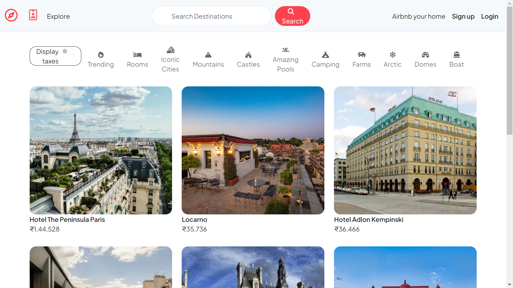

# Airbnb Clone

Welcome to the Airbnb Clone project, a web application built to replicate key features of Airbnb using EJS for the frontend, Node.js and Express.js for the backend, MongoDB for the database, Cloudinary for saving image data and Bing Maps API to display listing locations.

## Table of Contents

- [Features](#features)
- [Technologies Used](#technologies-used)
- [Demo](#demo)
- [Setup Instructions](#setup-instructions)
- [Contributing](#contributing)
- [Contact](#contact)

## Features

- **User Authentication**: Sign up, log in, and log out functionalities.
- **Profile Management**: User profile page to view and update personal information.
- **Listing Management**: Create, edit, and delete property listings.
- **Search and Filters**: Search for properties based on location, dates, and other criteria.
- **Bing Maps Integration**: Display property locations using Bing Maps API.
- **Responsive Design**: Fully responsive across devices for a seamless user experience.

## Technologies Used

- **Frontend**:
  - EJS (Embedded JavaScript) templates
  - HTML5, CSS3, Bootstrap , JavaScript 

- **Backend**:
  - Node.js
  - Express.js

- **Database**:
  - MongoDB

- **Maps Integration**:
  - Bing Maps API 

## Demo

[Live Demo](https://airbnb-majorproject-e1qd.onrender.com)



## Setup Instructions
    To set up the project locally, you'll need to clone and run therepository. Follow these steps:

1. **Clone the Repository:**

   ```bash
   git clone https://github.com/uditdev1/AirBnb_Clone.git
   cd Airbnb-MajorProject
   npm install 
   node app.js

2. **Set up environment variables:**
    remove .example from .env.example and update the details 

## Contributing

I welcome contributions! If you have suggestions for improvements or new features, feel free to submit a pull request or open an issue.

Fork the repository
Create a new branch (git checkout -b feature-branch)
Make your changes
Commit your changes (git commit -m 'Add some feature')
Push to the branch (git push origin feature-branch)
Create a new Pull Request


## Contact
If you have any questions or need further information, feel free to contact me:

[LinkedIn](https://www.linkedin.com/in/uditdev/)